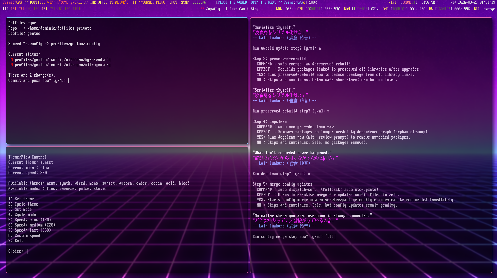
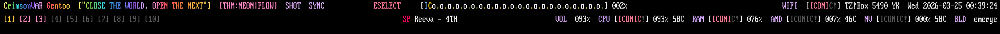

# CrimsonVAR Polybar (WIP)

Personal Polybar setup for i3 on Gentoo.

Status: work in progress, actively evolving.

## Screenshots

### Current full setup

### Slim bar view

## Current highlights

- Staged startup (`boot` bar -> main bars) with animated handoff
- Two-row primary monitor layout + workspace-only side monitor bars
- Theme/mode switcher with terminal menu
- Gentoo updater action module with guided yes/no workflow
- Dotfiles sync action module (private repo workflow)
- Flameshot screenshot integration
  - i3 keybinds: `Print` (select), `Shift+Print` (full save)
  - Polybar action module: `SHOT`

## Quick start

- Main config: `config.conf`
- Launcher: `launch.sh`
- Scripts: `scripts/`
- Full docs index: `documentation/README.md`

## Fresh install

For a fresh Gentoo system:

1. Read `documentation/FRESH_GENTOO_INSTALL.md`
2. Run `./scripts/install-gentoo.sh` from repo root

## Project notes

- This is a personal learning project (Linux since Dec 2025).
- Built with OpenAI Codex + manual edits/testing.
- Maintenance is best-effort.

See:

- `documentation/PROJECT_NOTICE.md`
- `documentation/ENVIRONMENT.md`
- `documentation/BACKUPS.md`
